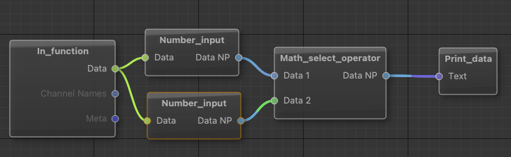
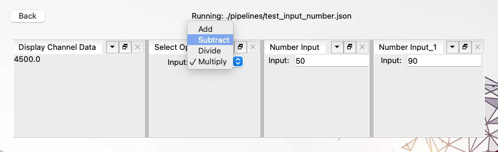

# Quickstart

The quickstart will walk you through creating and running a graph with existing nodes step by step and is aimed at getting you off the ground. If you prefer to investigate on your own, please have a look at the [example project git](https://gitlab.csl.uni-bremen.de/livenodes/example-project) which provides multiple awesome working examples.

What you'll need: 
- a working conda installation (required by Smart Studio). 
- x mins.

What we'll build:  
A simple graph that creates a sinus and cosine wave, subtracts them and plots all three values as graphs over time.

TODO: add an interaction element


## Setup

Create a conda environment and install livenodes and smart studio.

TODO: finish this up -> for now i recommend copying the example project :D
TODO: smart studio when opened in an empty project should ask if it should scaffold a project


## Start 

To open the gui application, run:

```
conda activate example_project
smart_studio
```

# Calculator Example 

This section gives an example on how a simple calculator application could be built with custom nodes. The application should take two numbers as input, apply a basic arithmetic operation and put out the result.

The calculator examples may seem odd, since Livenodes is at its heart a tool for digital signal processing. So usually a graph starts with a data stream which can be transformed and eventually plotted. However this example gives a good first glance at how Livenodes works by creating a simple calculator application.

Our graph has to start with a two data source nodes (Producer) which emit our numbers to a arithmetical operator node (Transformer) which emits the result to an output node (Sink). In the parenthesis is the required node categories, for more see [Node Categories](./node.md#node-categories).

At this point there is exists no input node that fulfills our requirement of entering a number and emitting it to the next node. However the [Annotate UI Button](https://gitlab.csl.uni-bremen.de/livenodes/packages/livenodes_qt/-/blob/main/src/livenodes_qt/annotate_ui_button.py) node provides a similar functionality. This node get's a stream of input data which it outputs unchanged and additionally a stream of the corresponding label. This could be used as a base for an input node. We'd like to choose the kind of operation that is executed on our input, so we need a node that receives two input streams, applies the desired operation and outputs the result. A good basis for this node is the [Math subtract](https://gitlab.csl.uni-bremen.de/livenodes/packages/livenodes_core_nodes/-/blob/main/src/livenodes_core_nodes/math_subtract.py) node. For selecting the operation we could use a combo box that sets the operator.

## Creating the input node

Above it was proposed that we use the `Annotate UI Button` node as a basis for our input node. If you take a closer look at this node you might wonder why, because this node requires a input stream (`ports_in = Ports_data()`), that is then annotated. Since we want to enter our own data, we don't need this input stream. Therefore it sounds reasonable to assign `Ports_empty()` to `ports_in` and simply keep the output data stream that contains our input. But here lies the first insight this example should give you. If we did as described, the `process` function of our node will never be executed and therefore no data is emitted to the next node. The easiest way to fix this, is to keep an additional node as a data source, whose only purpose it is to act as a clock and the emitted data is ignored by our node. In this example I decided to use the [In function](https://gitlab.csl.uni-bremen.de/livenodes/packages/livenodes_core_nodes/-/blob/main/src/livenodes_core_nodes/in_function.py) node. The other way would be to convert our node to a producer node which is discussed TODO: here

The rest of the node is pretty straight forward. The Node inherits from `View_QT`, because we need the GUI with a input field for entering the number which is stored into the multiprocessing Queue `number_q`. This part is implemented by the `_init_draw` function that each visualization node must implement. The Queue is read when the `process` function is executed and the value stored in `current_number`. We can't save the input directly to `current_number` because the View runs in a different thread. `process` is called after the previous node (In function) has emitted its data and emits itself data which leads to an execution of the `process` function of the subsequent node, which will be our arithmetic operator node.

``` python
class Number_input(View_QT):
    ports_in = Ports_data()
    ports_out = Ports_np()

    category = "Data Source"
    description = ""

    example_init = {
        "name": "Number Input",
        "initial_number": 0,
    }

    def __init__(self,
                 initial_number=0,
                 name="Number Input",
                 **kwargs):
        super().__init__(name=name, **kwargs)

        self.current_number = initial_number
        self.number_q = mp.Queue()

    def _settings(self):
        """
        Get the Nodes setup settings.
        Primarily used for serialization from json files.
        """
        return {
            "name": self.name,
            "initial_number": self.current_number
        }

    def process(self, data, **kwargs):

        while not self.number_q.empty():
            self.current_number = self.number_q.get()


        return self.ret(data_np=float(self.current_number))

    def __update_annot(self, text):
        try:
            number = float(text)
        except:
            number = self.current_number
            self.qline_current.setText("" if text == "" else str(self.current_number))

        self.current_number = number
        self.number_q.put(self.current_number)

    def _init_draw(self, parent):

        self.qline_current = QLineEdit(str(self.current_number))
        self.qline_current.textChanged.connect(self.__update_annot)


        layout = QFormLayout(parent)
        layout.setContentsMargins(0, 0, 0, 0)
        layout.addRow(QLabel('Input:'), self.qline_current)
```

## Creating the operator selection node

As mentioned above, this node is based on the `Math_subtract` node. The main difference is, that this node is also a visualization node and thus implements the `_init_draw` function. This function draws a combobox which lets us select our desired operator. Similarly to our input node this selection needs to be put in a multiprocessing queue. Depending on the selection the corresponding arithmetic operation is executed on the two input data streams.

```python
class Ports_in(NamedTuple):
    data_1: Port_np_compatible = Port_np_compatible("Data 1")
    data_2: Port_np_compatible = Port_np_compatible("Data 2")

class Math_select_operator(View_QT):
    
    # IO Ports
    ports_in = Ports_in()
    ports_out = Ports_np()

    # Meta information
    category = "Transform"
    description = ""

    example_init = {
        'name': 'Select Operator',
        'operator': "Add"
    }

    def __init__(self,
                 name="Select Operator",
                 operator="Add",
                 **kwargs):
        super().__init__(name=name, **kwargs)

        self.operator = operator

        self.operator_map = {
            "Add": np.add,
            "Subtract": np.subtract,
            "Divide": np.divide,
            "Multiply": np.multiply
        }

        self.operator_q = mp.Queue()

    # Sync Mechanism
    def _should_process(self, data_1=None, data_2=None):
        return data_1 is not None \
            and data_2 is not None
    
    def _settings(self):
        """
        Get the Nodes setup settings.
        Primarily used for serialization from json files.
        """
        return {
            "name": self.name,
            "operator": self.operator
        }

    # Processing Function
    def process(self, data_1, data_2, **kwargs):
        # we assume they have equal sizes or are broadcastable

        while not self.operator_q.empty():
            self.operator = self.operator_q.get()

        result = self.operator_map[self.operator](data_1, data_2)
        return self.ret(data_np=result)
    

    def __selection_change(self, text):
        self.operator = text
        self.operator_q.put(self.operator)
    

    def _init_draw(self, parent):
        self.cb = QComboBox()
        self.cb.activated[str].connect(self.__selection_change)
        
        for operator in self.operator_map.keys():
            self.cb.addItem(operator)


        layout = QFormLayout(parent)
        layout.setContentsMargins(0, 0, 0, 0)
        layout.addRow(QLabel('Input:'), self.cb)
```

## Creating a graph

Before the we can create the graph for the calculator application, we need to make sure that the nodes are introduced to the registry by modifying `start.py`. See the [Local Nodes and Packages](./packages.md) page for further information. 

After introducing new nodes to the registry, start smart studio:
```
python start.py
```

Now we can create a new graph that implements a calculator. The Graph should look like this:



The `In_function` node is used connects its data port to the `Number_input` nodes. The data only works as clock. The `Number_Input` nodes have a View to input a number which is emitted out through the Data NP port. This is connected to the input ports of the `Math_select_operator` node, which has a view to select the desired operation. The result of this operation is then emitted through the Data NP port and finally printed by the `Print_data` node.

## Running a graph

Executing the graph lets us see the three different view components that are at play. Left we have the output of the `Print_data` node, in the middle is the `Math_select_operator` node and to the right are the two `Number_input` nodes.


